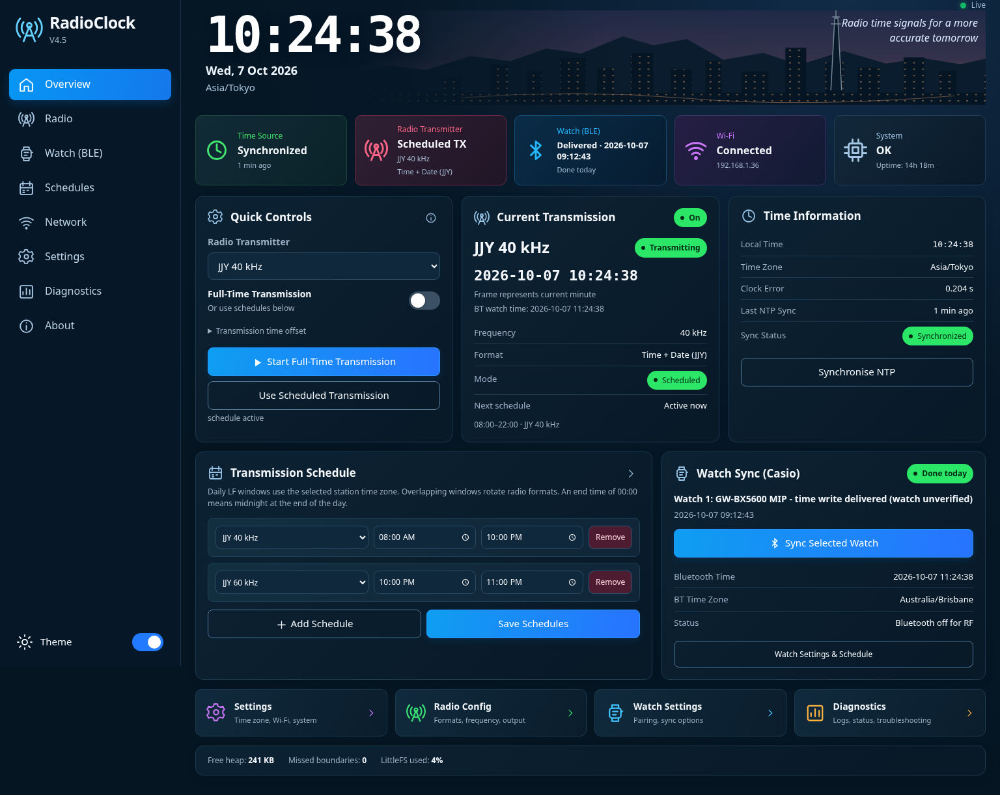

# Time Transmitter — RadioClock V4.5

Time Transmitter is an ESP32 project for synchronizing watches with local LF time signals or Casio Bluetooth time delivery. It combines an NTP-disciplined clock, configurable transmission schedules, a browser settings/dashboard UI, and hardware-timed carrier generation.
The transmitter uses a simple GPIO pin and a coil of about 150 turns of copper magnet wire around a 10mm ferrite rod of about 120mm length (from Jaycar),  the observed range of the transmitter (in JJY40 mode) is approximately 3-5 meters.  Which is much more than expected, and heaps for me (your results may vary)

RF transmission has priority: scanning and connections stop, the BLE host/controller shut down, and the carrier starts only after shutdown is confirmed. Bluetooth stays off for the whole RF session, including reduced/zero-carrier envelope slots.



Dashboard preview with sample status data.

## Features

- V4 dashboard based on the supplied UI mockup: dark sidebar, skyline clock banner, five live status tiles, transmission controls, schedules, Casio watch card and shortcuts. The layout adapts to phones and includes a saved light/dark theme.
- LF carrier generation with ESP32 LEDC and a hardware timer; envelope timing follows the system clock.
- Scheduled or continuous transmission, overlapping-schedule rotation, timezone selection, and a configurable transmission offset.
- NTP synchronization, adaptive resynchronization, clock-confidence checks, and holdover handling.
- Watch-initiated Casio BLE time delivery: GW-BX5600 MIP, selected standard digital/hybrid models, and an experimental analogue time-only profile.
- Separate Pair Watch and Sync Now controls, persistent watch profiles, safe manual retries, and optional Always Wait listening for the paired watch.
- The Watch card has an independent Bluetooth time-zone selector and additive offset, defaulting to Australia/Brisbane. The JJY/LF station time remains controlled by its own timezone and transmission offset.
- The main dashboard shows both the JJY transmitted time and the current civil time that the next Bluetooth watch write will use.
- Successful Bluetooth syncs show their date and time in the overview hero, watch card, and quick status. Automatic watch-sync slots are interpreted in the selected Bluetooth timezone plus offset, while LF schedules stay in the JJY/station timezone.
- A gzip-compressed web UI, LittleFS configuration storage, and Always on or Scheduled/power-save Wi-Fi.

| Time-signal format | Carrier |
| --- | --- |
| JJY East / West | 40 / 60 kHz |
| WWVB | 60 kHz |
| DCF77 | 77.5 kHz |
| MSF | 60 kHz |
| BPC | 68.5 kHz |
| BSF legacy experimental mode | 77.5 kHz, carrier only |

This is a local receiver emulator. Formats follow the selected timezone/offset; they do not necessarily reproduce the official station's civil-time convention. The existing JJY implementation keeps ordinary frames through the real station's call-sign periods for local watch acquisition.

## Hardware

The validated build target is a classic ESP32 Node32 / ESP32 Dev Module with 4 MB flash. The sketch's classic ESP32 pin assignments are:

| Output | GPIO |
| --- | --- |
| LF carrier to transmitter circuit | 26 |
| Buzzer envelope feedback | 27 |
| RF envelope LED | 25 |
| Wi-Fi/system LED | 2 |

The firmware provides the carrier output for an external transmitter/antenna circuit. ESP32-C3 pin mappings are retained in the source, but that target has not been compile-tested for this version.

## Build

The tested target is the classic ESP32 Node32 / ESP32 Dev Module with 4 MB flash, Arduino-ESP32 **3.3.11**, NimBLE-Arduino **2.5.1**, and ArduinoJson **6.21.5**. The sketch-local partition table has a 3 MB application partition and LittleFS storage.

For Arduino IDE, install those board/library versions and open:

`firmware/RadioClock_V4_5/RadioClock_V4_5.ino`

Keep `RadioBleArbiter.h`, `CasioBxProtocol.h`, and `partitions.csv` beside the sketch. For **ESP32 Dev Module**, select **Flash Size: 4MB (32Mb)** and **Partition Scheme: Huge APP (3MB No OTA/1MB SPIFFS)**. The default 1.25 MB application partition is too small for this project. On **Node32s**, **No OTA (Large APP)** also provides sufficient compile capacity; the included sketch-local partition table supplies the project's 3 MB application layout. This layout has one application slot and does not support dual-slot OTA updates.

In the Codex Linux cloud workspace:

```bash
cd /workspace/time-transmitter
bash scripts/install-toolchain.sh
bash scripts/compile.sh
bash scripts/test.sh
```

The installer keeps the pinned tools and packages in `/workspace/.radioclock-tools`, checks the official CLI checksum, and retains Arduino package signature/checksum and TLS verification. It uses injected proxy configuration when present. A later task can reuse the installed snapshot. Cloud tasks already have isolated checkouts; use this checkout without creating a Git worktree.

Build outputs are in `/workspace/.radioclock-tools/output/RadioClock_V4_5`. Override `RADIOCLOCK_TOOLS_DIR` to move tool storage or `RADIOCLOCK_BUILD_JOBS` to change the default two compiler jobs. `RADIOCLOCK_FQBN` is available for another compatible target, which needs its own validation.

## Watch controls

Select the watch profile and protocol in Settings. Use **Pair Watch** for first pairing or replacement. The existing watch address, name, and protocol are replaced only after the new watch receives an acknowledged time write. **Sync Now** restarts a manual wait window safely and requires an already paired watch.

For the GW-BX5600, module 3578:

- Pair/connect: hold **C for at least 3 seconds** until the Bluetooth symbol and **CONNECT WITH A PHONE** flash.
- Manual time correction: from **Timekeeping Mode, press D once**.

The **BX1** build corrects the SP settings/city record framing and logs the exact
handshake stage, negotiated MTU, and ATT error. It preserves the watch's existing
settings and sends complete packets with their required write modes. See
[the handshake evidence and device check](docs/GW-BX5600-SP-handshake.md).

**Always wait for watch sync requests** listens only for the selected paired watch while RF is idle. JJY/LF has absolute priority: BLE is shut down during RF and resumes afterward. If RF covers an entire automatic Bluetooth window, that watch attempt cannot be received. It never learns an unknown watch. Watches that rotate their BLE address may require explicit pairing again; the binding filter remains strict.

The Watch card's **Bluetooth time zone** and **Bluetooth time offset** apply only to BLE watch writes and automatic Bluetooth sync slots. They default to Australia/Brisbane and zero additional offset, and support the same fixed/DST-aware zones shown by the main clock. JJY and the other LF encoders continue using the main **Time zone** and **Transmission offset** settings. The dashboard's JJY card reports the active radio time and the calculated Bluetooth watch time together, and the overview records the date and time of the last successful Bluetooth write.

Automatic watch slots save when their switches or settings change. Each enabled time repeats every day until you disable it, even if the watch has already synchronized at another time that day. Saving an LF transmission schedule does not change those switches. Settings writes finish before the UI reports success and survive power restarts; a storage error is reported instead of a successful save. RF still takes priority during overlapping windows.

**Disable Wi-Fi sleep / Keep Wi-Fi always on** uses the existing Wi-Fi power-mode enum: enabled is Always on (`0`); disabled is Scheduled/power-save (`1`). It also applies the corresponding Wi-Fi driver sleep setting. There is no independent persistent sleep flag.

## Editable UI and validation

The live source is `ui/radioclock.html`.

V4.5 keeps the approved dashboard and closes the final-review issues in clock synchronization, Bluetooth scheduling and the schedule editor. Each watch target is eligible from five minutes before through five minutes after in the independent Bluetooth timezone. Editing a slot makes its revised window eligible again, disabling it cancels its active listening window, and partial RF overlaps remain enabled with RF taking priority. Sydney Bluetooth daylight-saving transitions use the correct UTC boundary. The LF editor preserves drafts when rows are added or removed and accepts midnight as the end of the day. Successful Bluetooth delivery status and its timestamp survive a reboot. BPC encodes each 20-second block separately. Adaptive NTP updates its next interval without continually restarting the client and retains a conservative drift estimate until a real measurement exists.

The main page follows `ui/v32_ui_mockup.png`, using self-contained SVG icons and a skyline illustration without external fonts, images or scripts. The fixed left sidebar keeps all eight labelled items at every screen width: Overview, Radio, Watch (BLE), Schedules, Network, Settings, Diagnostics and About. Each opens its own page. Radio and LF schedule controls use the same DOM elements as their overview cards, so unsaved edits survive navigation. Its controls call the existing APIs, and JJY/LF and Bluetooth time remain separately visible.

Before publishing, compare the rendered UI against the user's request and the approved mockup. Ask before changing the fundamental layout or deviating from that design. These release requirements are recorded in `AGENTS.md`.

[Download the V4.5 source ZIP](https://github.com/whitto/time-transmitter/archive/refs/tags/v4.5.zip).

After editing the UI, regenerate its embedded gzip asset and run checks:

```bash
python3 scripts/embed-ui.py
bash scripts/test.sh
bash scripts/compile.sh
```

The checks run the actual UI script against mocked APIs, compile extracted firmware functions against host mocks, stress the real atomic RF/BLE arbiter concurrently, and verify gzip, DOM references, API routes, versions, and partition bounds. They exercise state transitions and failures; they do not emulate the ESP32 radio or prove the watch display changed. With Playwright and Chromium installed, run `node scripts/test-ui-browser.cjs` for the real-browser schedule, toggle and pairing regressions; set `RADIOCLOCK_CHROMIUM` if the browser executable is elsewhere.

See `docs/V4.5-review.md` for the current release checks. `docs/V4.2-review.md` and `docs/V3.5-review.md` record earlier changes and hardware acceptance steps. `baseline/`, `diff/`, `docs/CODEX_HANDOFF.md`, and `docs/RadioClock_Senior_Review.md` are historical handoff material. `ui/v321_ui_baseline.html` is the original UI, kept for comparison.

## Build status

V4.5 uses the classic ESP32 Node32 / ESP32 Dev Module target, Arduino-ESP32 3.3.11 toolchain and 3 MB application partition. The repository tests target the V4.5 sketch and exercise NTP drift/interval handling, timezone transitions, BPC block fields, Bluetooth slot updates, RF pre-emption, configuration persistence and UI requests. Compile and browser evidence is recorded in `docs/V4.5-review.md`. Physical watch and RF acceptance remain device tests.

## Credits and provenance

The supplied RadioClock source retains these original credits:

- **taroh (GitHub: tarohs)** — original [nisejjy](https://github.com/tarohs/nisejjy) software-radio code, copyright **2021**.
- **5Breeze** — [ClockWaveXmitter](https://github.com/5Breeze/ClockWaveXmitter) improvements, copyright **2025**; the source identifies web UI, Wi-Fi configuration, multi-station scheduling, and station rotation additions. Its README also credits nisejjy and requests source credit for redistribution, adaptation, or commercial use.
- **RadioClock V2.7 through V3.2.2** — the supplied firmware lineage and baseline used for this project's V3.5 continuation. The V3.2.1 source is preserved in `baseline/` for comparison.

Those copyright notices remain in the firmware headers. V4.5 preserves the V4.1 dashboard and V3.5 BLE lifecycle/write-mode corrections, transactional pairing, passive listening, RF/BLE arbitration and build tooling, with the final-review corrections described above.

The project also uses these libraries and platforms:

- [Arduino-ESP32](https://github.com/espressif/arduino-esp32) — Espressif's Arduino platform and its Wi-Fi, WebServer, LittleFS, timer, and LEDC integrations.
- [NimBLE-Arduino](https://github.com/h2zero/NimBLE-Arduino) — the NimBLE-based Bluetooth stack maintained by h2zero and contributors, building on Apache Mynewt NimBLE.
- [ArduinoJson](https://github.com/bblanchon/ArduinoJson) — JSON parsing and serialization by Benoît Blanchon and contributors.
- [Arduino CLI](https://github.com/arduino/arduino-cli) — reproducible cloud builds and dependency installation.
- [izivkov/gshock_api](https://github.com/izivkov/gshock_api) — public GW-BX5600 official-app Bluetooth captures used to check the SP packet structure. The BX1 packet helper was implemented independently from those observations.

The JJY implementation references [NICT's time-signal specification](https://jjy.nict.go.jp/jjy/trans/index-e.html). Firmware comments also acknowledge NIST (WWVB), PTB (DCF77), NPL (MSF), and BPC signal specifications. These are standards references, separate from source-code authorship.

Neither nisejjy nor ClockWaveXmitter currently declares a standard software license or includes a LICENSE file, and the uploaded handoff did not include a project-level license grant. This repository preserves the supplied author notices and does not invent a license for inherited code. Dependencies retain their own licenses, including Arduino-ESP32's [LGPL 2.1](https://github.com/espressif/arduino-esp32/blob/3.3.11/LICENSE.md) and NimBLE-Arduino's [Apache 2.0](https://github.com/h2zero/NimBLE-Arduino/blob/2.5.1/LICENSE).
